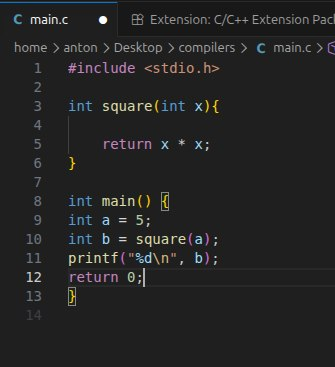
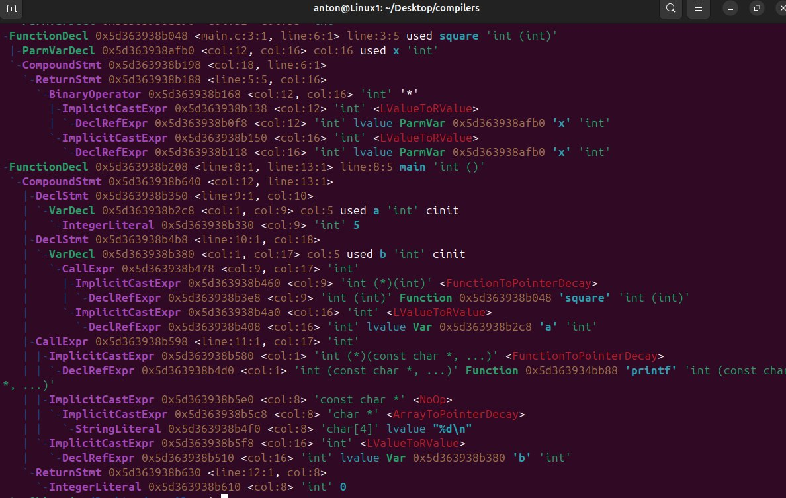
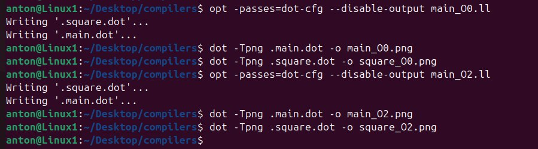
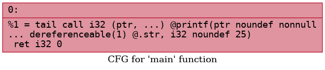
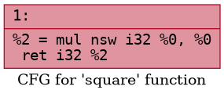
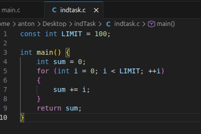
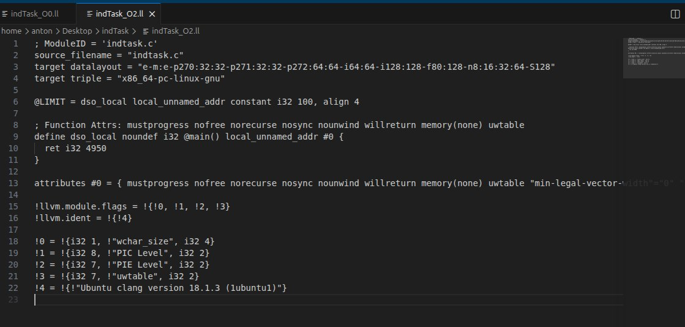
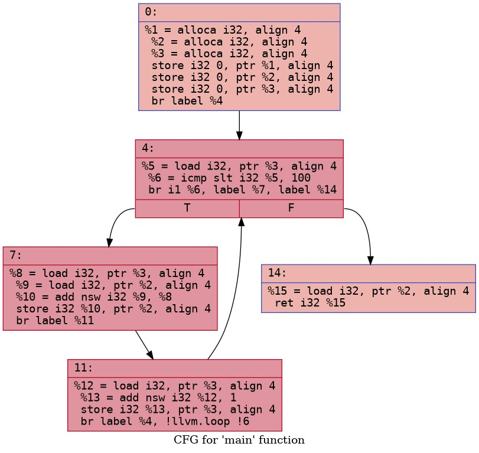
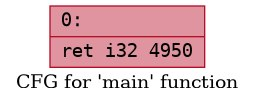

 
# Лабораторная работа 7. Анализ и преобразование кода с использованием Clang и LLVM

## Цель работы: 
Познакомиться с инструментарием Clang и LLVM, освоить получение абстрактного синтаксического дерева (AST) и промежуточного представления (LLVM IR) для кода на C/C++, научиться применять базовые оптимизации, строить графы потока управления (CFG), а также анализировать влияние оптимизаций на различные синтаксические конструкции языка.

## **Автор:** 

 Cтудент группы АВТ-313 Геращенко Антон Евгеньевич

## Постановка задачи:
1) Установить Clang и LLVM;
2) Скомпилировать простой C-файл с использованием clang и
получить его: абстрактное синтаксическое дерево (AST), промежуточное
представление LLVM IR;
3) Использовать opt для применения базовой комплексной
оптимизации (например, О2);
4) Построить граф потока управления (CFG) для оптимизированной
программы;
5) Проанализировать результат, сделать выводы и ответить на
контрольные вопросы.
6) Выполнить индивидуальное задание:
```
Тема: Целочисленные константы

Пример кода:
const int LIMIT = 100;
int main() {
int sum = 0;
for (int i = 0; i < LIMIT; ++i) {
sum += i;
}
return sum;
}

Задания:
1. Получите IR для -O0.
2. Примените -O2 и найдите, исчезла ли переменная LIMIT.
3. Примените отдельно -constprop и -ipsccp.
4. Постройте CFG до и после оптимизаций.
5. Сделайте вывод о том, как и когда константа подставляется?
```
## Основное задание:

## Установка Clang и LLVM:
```
sudo apt install update
sudo apt install clang llvm graphviz
```
## **Код задания:**

- **Получение AST**
 
- **промежуточное представление LLVM IR O0**
 > clang -O0 -S -emit-llvm main.c -o main_O0.ll
```
; ModuleID = 'main.c'
source_filename = "main.c"
target datalayout = "e-m:e-p270:32:32-p271:32:32-p272:64:64-i64:64-i128:128-f80:128-n8:16:32:64-S128"
target triple = "x86_64-pc-linux-gnu"

@.str = private unnamed_addr constant [4 x i8] c"%d\0A\00", align 1

; Function Attrs: noinline nounwind optnone uwtable
define dso_local i32 @square(i32 noundef %0) #0 {
  %2 = alloca i32, align 4
  store i32 %0, ptr %2, align 4
  %3 = load i32, ptr %2, align 4
  %4 = load i32, ptr %2, align 4
  %5 = mul nsw i32 %3, %4
  ret i32 %5
}

; Function Attrs: noinline nounwind optnone uwtable
define dso_local i32 @main() #0 {
  %1 = alloca i32, align 4
  %2 = alloca i32, align 4
  %3 = alloca i32, align 4
  store i32 0, ptr %1, align 4
  store i32 5, ptr %2, align 4
  %4 = load i32, ptr %2, align 4
  %5 = call i32 @square(i32 noundef %4)
  store i32 %5, ptr %3, align 4
  %6 = load i32, ptr %3, align 4
  %7 = call i32 (ptr, ...) @printf(ptr noundef @.str, i32 noundef %6)
  ret i32 0
}

declare i32 @printf(ptr noundef, ...) #1

attributes #0 = { noinline nounwind optnone uwtable "frame-pointer"="all" "min-legal-vector-width"="0" "no-trapping-math"="true" "stack-protector-buffer-size"="8" "target-cpu"="x86-64" "target-features"="+cmov,+cx8,+fxsr,+mmx,+sse,+sse2,+x87" "tune-cpu"="generic" }
attributes #1 = { "frame-pointer"="all" "no-trapping-math"="true" "stack-protector-buffer-size"="8" "target-cpu"="x86-64" "target-features"="+cmov,+cx8,+fxsr,+mmx,+sse,+sse2,+x87" "tune-cpu"="generic" }

!llvm.module.flags = !{!0, !1, !2, !3, !4}
!llvm.ident = !{!5}

!0 = !{i32 1, !"wchar_size", i32 4}
!1 = !{i32 8, !"PIC Level", i32 2}
!2 = !{i32 7, !"PIE Level", i32 2}
!3 = !{i32 7, !"uwtable", i32 2}
!4 = !{i32 7, !"frame-pointer", i32 2}
!5 = !{!"Ubuntu clang version 18.1.3 (1ubuntu1)"}
```
- **промежуточное представление LLVM IR O2**
> clang -O2 -S -emit-llvm main.c -o main_O2.ll
```
; ModuleID = 'main.c'
source_filename = "main.c"
target datalayout = "e-m:e-p270:32:32-p271:32:32-p272:64:64-i64:64-i128:128-f80:128-n8:16:32:64-S128"
target triple = "x86_64-pc-linux-gnu"

@.str = private unnamed_addr constant [4 x i8] c"%d\0A\00", align 1

; Function Attrs: mustprogress nofree norecurse nosync nounwind willreturn memory(none) uwtable
define dso_local i32 @square(i32 noundef %0) local_unnamed_addr #0 {
  %2 = mul nsw i32 %0, %0
  ret i32 %2
}

; Function Attrs: nofree nounwind uwtable
define dso_local noundef i32 @main() local_unnamed_addr #1 {
  %1 = tail call i32 (ptr, ...) @printf(ptr noundef nonnull dereferenceable(1) @.str, i32 noundef 25)
  ret i32 0
}

; Function Attrs: nofree nounwind
declare noundef i32 @printf(ptr nocapture noundef readonly, ...) local_unnamed_addr #2

attributes #0 = { mustprogress nofree norecurse nosync nounwind willreturn memory(none) uwtable "min-legal-vector-width"="0" "no-trapping-math"="true" "stack-protector-buffer-size"="8" "target-cpu"="x86-64" "target-features"="+cmov,+cx8,+fxsr,+mmx,+sse,+sse2,+x87" "tune-cpu"="generic" }
attributes #1 = { nofree nounwind uwtable "min-legal-vector-width"="0" "no-trapping-math"="true" "stack-protector-buffer-size"="8" "target-cpu"="x86-64" "target-features"="+cmov,+cx8,+fxsr,+mmx,+sse,+sse2,+x87" "tune-cpu"="generic" }
attributes #2 = { nofree nounwind "no-trapping-math"="true" "stack-protector-buffer-size"="8" "target-cpu"="x86-64" "target-features"="+cmov,+cx8,+fxsr,+mmx,+sse,+sse2,+x87" "tune-cpu"="generic" }

!llvm.module.flags = !{!0, !1, !2, !3}
!llvm.ident = !{!4}

!0 = !{i32 1, !"wchar_size", i32 4}
!1 = !{i32 8, !"PIC Level", i32 2}
!2 = !{i32 7, !"PIE Level", i32 2}
!3 = !{i32 7, !"uwtable", i32 2}
!4 = !{!"Ubuntu clang version 18.1.3 (1ubuntu1)"}
```
- **Сравнение оптимизаций**
> diff main_O0.ll main_O2.ll
```
8,15c8,11
< ; Function Attrs: noinline nounwind optnone uwtable
< define dso_local i32 @square(i32 noundef %0) #0 {
<   %2 = alloca i32, align 4
<   store i32 %0, ptr %2, align 4
<   %3 = load i32, ptr %2, align 4
<   %4 = load i32, ptr %2, align 4
<   %5 = mul nsw i32 %3, %4
<   ret i32 %5
---
> ; Function Attrs: mustprogress nofree norecurse nosync nounwind willreturn memory(none) uwtable
> define dso_local i32 @square(i32 noundef %0) local_unnamed_addr #0 {
>   %2 = mul nsw i32 %0, %0
>   ret i32 %2
18,29c14,16
< ; Function Attrs: noinline nounwind optnone uwtable
< define dso_local i32 @main() #0 {
<   %1 = alloca i32, align 4
<   %2 = alloca i32, align 4
<   %3 = alloca i32, align 4
<   store i32 0, ptr %1, align 4
<   store i32 5, ptr %2, align 4
<   %4 = load i32, ptr %2, align 4
<   %5 = call i32 @square(i32 noundef %4)
<   store i32 %5, ptr %3, align 4
<   %6 = load i32, ptr %3, align 4
<   %7 = call i32 (ptr, ...) @printf(ptr noundef @.str, i32 noundef %6)
---
> ; Function Attrs: nofree nounwind uwtable
> define dso_local noundef i32 @main() local_unnamed_addr #1 {
>   %1 = tail call i32 (ptr, ...) @printf(ptr noundef nonnull dereferenceable(1) @.str, i32 noundef 25)
33c20,21
< declare i32 @printf(ptr noundef, ...) #1
---
> ; Function Attrs: nofree nounwind
> declare noundef i32 @printf(ptr nocapture noundef readonly, ...) local_unnamed_addr #2
35,36c23,25
< attributes #0 = { noinline nounwind optnone uwtable "frame-pointer"="all" "min-legal-vector-width"="0" "no-trapping-math"="true" "stack-protector-buffer-size"="8" "target-cpu"="x86-64" "target-features"="+cmov,+cx8,+fxsr,+mmx,+sse,+sse2,+x87" "tune-cpu"="generic" }
< attributes #1 = { "frame-pointer"="all" "no-trapping-math"="true" "stack-protector-buffer-size"="8" "target-cpu"="x86-64" "target-features"="+cmov,+cx8,+fxsr,+mmx,+sse,+sse2,+x87" "tune-cpu"="generic" }
---
> attributes #0 = { mustprogress nofree norecurse nosync nounwind willreturn memory(none) uwtable "min-legal-vector-width"="0" "no-trapping-math"="true" "stack-protector-buffer-size"="8" "target-cpu"="x86-64" "target-features"="+cmov,+cx8,+fxsr,+mmx,+sse,+sse2,+x87" "tune-cpu"="generic" }
> attributes #1 = { nofree nounwind uwtable "min-legal-vector-width"="0" "no-trapping-math"="true" "stack-protector-buffer-size"="8" "target-cpu"="x86-64" "target-features"="+cmov,+cx8,+fxsr,+mmx,+sse,+sse2,+x87" "tune-cpu"="generic" }
> attributes #2 = { nofree nounwind "no-trapping-math"="true" "stack-protector-buffer-size"="8" "target-cpu"="x86-64" "target-features"="+cmov,+cx8,+fxsr,+mmx,+sse,+sse2,+x87" "tune-cpu"="generic" }
38,39c27,28
< !llvm.module.flags = !{!0, !1, !2, !3, !4}
< !llvm.ident = !{!5}
---
> !llvm.module.flags = !{!0, !1, !2, !3}
> !llvm.ident = !{!4}
45,46c34
< !4 = !{i32 7, !"frame-pointer", i32 2}
< !5 = !{!"Ubuntu clang version 18.1.3 (1ubuntu1)"}
---
> !4 = !{!"Ubuntu clang version 18.1.3 (1ubuntu1)"}
```

### Изменения после оптимизации:
1) Переменные типа alloca были удалены;
2) Код переведён в SSA-форму;
3) Оптимизация улучшила читаемость и упростила поток
управления.

## Построение CFG для оптимизированного LLVM IR:
**Команды для генерации CFG:**

- CFG main в PNG-формате:
  
- CFG square в PNG-формате:
  

# Индивидуальное задание:
- программа варианта:

1) Получение IR -O0:
> clang -O0 -S -emit-llvm indTask.c -o indTask_O0.ll
```
; ModuleID = 'indtask.c'
source_filename = "indtask.c"
target datalayout = "e-m:e-p270:32:32-p271:32:32-p272:64:64-i64:64-i128:128-f80:128-n8:16:32:64-S128"
target triple = "x86_64-pc-linux-gnu"

@LIMIT = dso_local constant i32 100, align 4

; Function Attrs: noinline nounwind optnone uwtable
define dso_local i32 @main() #0 {
  %1 = alloca i32, align 4
  %2 = alloca i32, align 4
  %3 = alloca i32, align 4
  store i32 0, ptr %1, align 4
  store i32 0, ptr %2, align 4
  store i32 0, ptr %3, align 4
  br label %4

4:                                                ; preds = %11, %0
  %5 = load i32, ptr %3, align 4
  %6 = icmp slt i32 %5, 100
  br i1 %6, label %7, label %14

7:                                                ; preds = %4
  %8 = load i32, ptr %3, align 4
  %9 = load i32, ptr %2, align 4
  %10 = add nsw i32 %9, %8
  store i32 %10, ptr %2, align 4
  br label %11

11:                                               ; preds = %7
  %12 = load i32, ptr %3, align 4
  %13 = add nsw i32 %12, 1
  store i32 %13, ptr %3, align 4
  br label %4, !llvm.loop !6

14:                                               ; preds = %4
  %15 = load i32, ptr %2, align 4
  ret i32 %15
}

attributes #0 = { noinline nounwind optnone uwtable "frame-pointer"="all" "min-legal-vector-width"="0" "no-trapping-math"="true" "stack-protector-buffer-size"="8" "target-cpu"="x86-64" "target-features"="+cmov,+cx8,+fxsr,+mmx,+sse,+sse2,+x87" "tune-cpu"="generic" }

!llvm.module.flags = !{!0, !1, !2, !3, !4}
!llvm.ident = !{!5}

!0 = !{i32 1, !"wchar_size", i32 4}
!1 = !{i32 8, !"PIC Level", i32 2}
!2 = !{i32 7, !"PIE Level", i32 2}
!3 = !{i32 7, !"uwtable", i32 2}
!4 = !{i32 7, !"frame-pointer", i32 2}
!5 = !{!"Ubuntu clang version 18.1.3 (1ubuntu1)"}
!6 = distinct !{!6, !7}
!7 = !{!"llvm.loop.mustprogress"}
```
2) Получение IR -O2:
> clang -O2 -S -emit-llvm indTask.c -o indTask_O0.ll

- Изменение Limit:
```
< @LIMIT = dso_local constant i32 100
> @LIMIT = dso_local local_unnamed_addr constant i32 100
```
> В -O2 появился атрибут local_unnamed_addr, 
> это означает, что адрес объекта не имеет значения в пределах модуля,
> а его значение уже было подставлено в цикл main функции.
> Но сама переменная не исчезла.
```
< ; Function Attrs: noinline nounwind optnone uwtable
< define dso_local i32 @main() #0 {
<   %1 = alloca i32, align 4
<   %2 = alloca i32, align 4
<   %3 = alloca i32, align 4
<   store i32 0, ptr %1, align 4
<   store i32 0, ptr %2, align 4
<   store i32 0, ptr %3, align 4
<   br label %4
< 
< 4:                                                ; preds = %11, %0
<   %5 = load i32, ptr %3, align 4
<   %6 = icmp slt i32 %5, 100
<   br i1 %6, label %7, label %14
< 
< 7:                                                ; preds = %4
<   %8 = load i32, ptr %3, align 4
<   %9 = load i32, ptr %2, align 4
<   %10 = add nsw i32 %9, %8
<   store i32 %10, ptr %2, align 4
<   br label %11
< 
< 11:                                               ; preds = %7
<   %12 = load i32, ptr %3, align 4
<   %13 = add nsw i32 %12, 1
<   store i32 %13, ptr %3, align 4
<   br label %4, !llvm.loop !6
< 
< 14:                                               ; preds = %4
<   %15 = load i32, ptr %2, align 4
<   ret i32 %15
---
> ; Function Attrs: mustprogress nofree norecurse nosync nounwind willreturn memory(none) uwtable
> define dso_local noundef i32 @main() local_unnamed_addr #0 {
>   ret i32 4950
```
> Цикл был распознан как чистая арифметика, сумма была вычислена на этапе компиляции.
> Поэтому весь main свелся к функции возврата ret i32 4950

3) -constprop и -ipsccp отдельно:
> Применение этих опций отдельно для -O0 не дало результатов:
> команда diff ничего не показала в обоих случаях.
- Вывод:
> Отдельные проходы constprop и ipsccp не изменяют IR, так как они не работают с переменными, хранящимися в памяти (alloca), и не
> анализируют циклы внутри одной функции. ipsccp выполняет только межпроцедурную пропагацию констант,
> а программа содержит только одну функцию main. Оптимизация цикла и вычисление суммы на этапе компиляции выполняется только в составе
> комплексной оптимизации -O2.
4) Построение CFG:
> Команды получения .png:


- Граф для -O0:

- Граф для -O2:

> В варианте без оптимизаций (O0) функция main имеет полноценную структуру управления:
> присутствуют несколько базовых блоков: входной блок, блок проверки условия, блок тела цикла, блок инкремента и блок выхода;
> управление передаётся по циклу while, что отражено в виде обратного ребра из блока инкремента обратно в блок условия;
> все переменные хранятся в памяти (alloca → load → store), поэтому CFG содержит множество инструкций загрузки и записи;
- После применения оптимизации -O2:
> весь цикл был полностью вычислен на этапе компиляции
> тело функции сведено к одной инструкции **ret i32 4950**
> в CFG остался ровно один базовый блок
## Вывод:
- На этапе -O0:
```
Константа Limit уже подставилась в main:
icmp slt i32 %5, 100
Переменная Limit существует:
@LIMIT = dso_local constant i32 100, align 4
```
- На этапе -O2:
```
Переменная Limit стала с атрибутом local_unnamed_addr:
@LIMIT = dso_local local_unnamed_addr constant i32 100,
то есть ее адрес в рамках модуля не имеет значения.
```
> Таким образом, подстановка константы происходит рано на уровне фронтенда clang,
> а полное использование этой константы для свёртывания цикла — на стадии -O2.

## Выводы
1) Что такое Clang?  
> Фронтенд компилятора для C/C++/Objective‑C, который превращает исходный код в AST и LLVM IR.
2) Что такое LLVM?  
> Модульная инфраструктура компиляторов, выполняющая оптимизации и генерацию машинного кода на основе IR.
3) Чем AST отличается от LLVM IR?  
> AST отражает синтаксис программы, IR — низкоуровневые инструкции для оптимизаций и генерации кода.
4) Зачем нужно IR?  
> Чтобы иметь единый, удобный для анализа и оптимизаций формат, независимый от языка и архитектуры.
5) Что делает alloca?  
> Выделяет память на стеке для локальных переменных в не‑оптимизированном IR.
6) Зачем нужна оптимизация?  
> Чтобы ускорить программу, уменьшить размер кода и убрать лишние вычисления.
7) Что такое SSA?  
> Форма IR, где каждая переменная присваивается один раз; упрощает анализ и оптимизации.
8) Что такое CFG?  
> Граф потока управления — схема переходов между базовыми блоками, показывающая структуру выполнения программы.
9) Как представлены арифметические операции в IR?  
> Как простые инструкции (add, mul, sub, icmp) с явными типами и операндами.
10) Почему функции — отдельные единицы анализа?  
> Потому что их можно оптимизировать, встраивать и анализировать независимо.
11) Что происходит с короткой функцией, вызываемой один раз?  
> Она обычно встраивается (inline) прямо в место вызова и может исчезнуть как отдельная функция.
12) Преимущества IR и CFG перед анализом исходного C‑кода  
> Они проще, формальнее и однозначнее, что позволяет автоматизировать оптимизации и анализ без сложностей синтаксиса.

