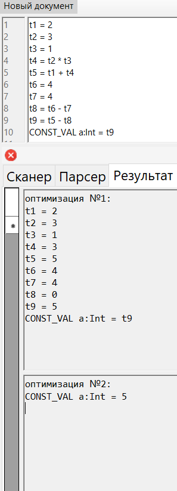
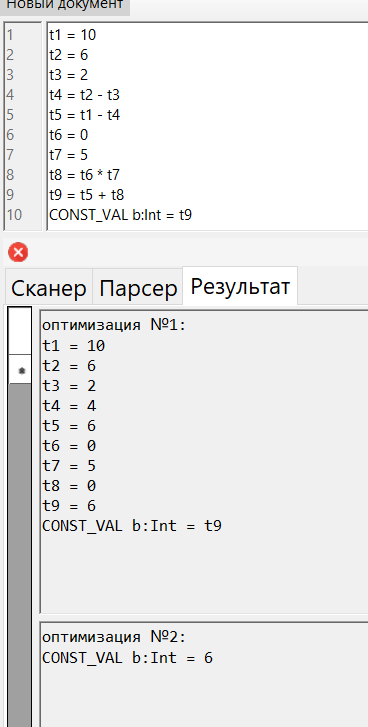
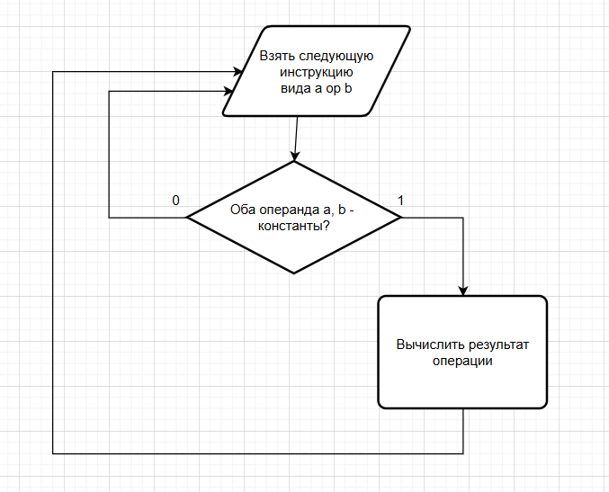
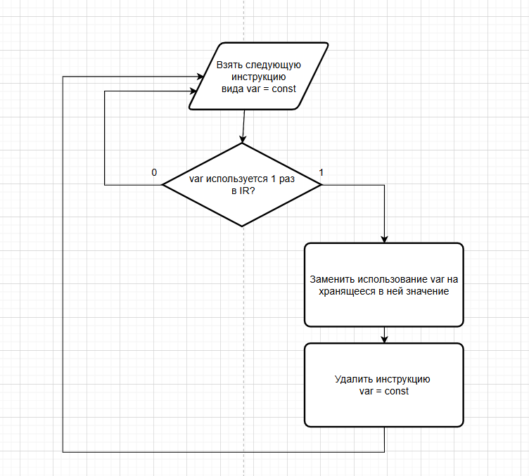

# Оглавление

- [Лабораторная работа №4: Реализация алгоритма поиска подстрок с помощью регулярных выражений](#лабораторная-работа-4-реализация-алгоритма-поиска-подстрок-с-помощью-регулярных-выражений)
- [Лабораторная работа №5: Построение AST и проверка контекстно-зависимых условий](#лабораторная-работа-5-построение-ast-и-проверка-контекстно-зависимых-условий)
- [Лабораторная работа №6: Создание внутренней формы представления программы](#лабораторная-работа-6-создание-внутренней-формы-представления-программы)
- [Лабораторная работа №7: Анализ и преобразование кода с использованием Clang и LLVM](#лабораторная-работа-7-анализ-и-преобразование-кода-с-использованием-clang-и-llvm)
 
# Лабораторная работа №4. Реализация алгоритма поиска подстрок с помощью регулярных выражений

## Цель работы: 
Изучить теоретические основы регулярных выражений и их применение для поиска и извлечения подстрок из текста. Освоить практические навыки использования библиотечных средств работы с регулярными выражениями, а также интеграцию алгоритмов поиска в графический интерфейс приложения.

## **Автор:** 

 Cтудент группы АВТ-313 Геращенко Антон Евгеньевич

## Постановка задачи:
Разработать модуль поиска подстрок с использованием регулярных выражений, интегрировать его в существующее приложение (текстовый редактор) и обеспечить наглядный вывод результатов.
### Вариант:
1) №8. Построить РВ для поиска закрывающего HTML-тега \</p>
2) №17. Построить РВ для поиска переменной в стиле snakeCase (используют только строчные буквы и нижние подчеркивания).
3) №8. Построить РВ для проверки данных полного DOI (идентификатор цифрового объекта).

# Решение задач:

## 1. Поиск закрывающего HTML-тега \</p>
### a) Описание задачи;
Найти в тексте все закрывающие теги абзацев HTML вида: \</p> \</P>
### b) Регулярное выражение с пояснением каждого обозначения.
```
</[pP]>

Описание:
<, /, > - символы,
[pP] - класс символов (P или p)
```
### c) Примеры строк, которые должны находиться;
```
</p>
</P>
text</p>more
</P> end
```
### d) Примеры строк, которые не должны находиться;
```
<p>
</pp>
</p extra>
< /p>
```
### e) Тестовый пример:


## 2. Поиск переменной в стиле snakeCase (используются только строчные буквы и нижние подчеркивания)
### a) Описание задачи;
Найти слова, соответствующие строгому snake_case: хотя бы один символ '_'.
### b) Регулярное выражение с пояснением каждого обозначения.
```
\b[a-z]+(?:_[a-z]+)+\b

Описание:
\b - границы слова,
[a-z]+ - усеченная итерация любого символа английского строчного алфавита,
(?: ) - объявление незахватывающей группы,
(?:_[a-z]+)+ - усеченная итерация цепочки _letter^+
```
### c) Примеры строк, которые должны находиться;
```
snake_case
very_long_snake_case
a_b
c_d_e

```
### d) Примеры строк, которые не должны находиться;
```
Snake_Case
snake__case
snake_case_
_snake_case
snake1_case
mix_of_snake_andWords
```
### e) Тестовый пример:


## 3. Проверка данных полного DOI (идентификатор цифрового объекта)
### a) Описание задачи;
Найти DOI в тексте в одном из форматов:
```
1) 10.xxxx/xxxxx
2) doi:10.xxxx/...
3) https://doi.org/10.xxxx/...
4) https://dx.doi.org/10.xxxx/...
В суффиксе допускаются только символы -._;()/:A-Za-z0-9
Регистрационный номер в префиксе - от 4 до 9 символов.
```
### b) Регулярное выражение с пояснением каждого обозначения.
```
\b(?:https?://(?:dx\.)?doi\.org/|doi:)?10\.\d{4,9}/(?!/)[-._;()/:A-Za-z0-9]+(?=\s|$)

Описание:
\b - границы слова,
(?: ) - объявление незахватывающей группы,
https?:// - набор символов, s - необязательный,
(?:dx\.)? - необязательная часть DOI (старый формат); символы dx и экранированная точка,
doi\.org/ - обязательная часть если домен,
｜doi: - либо ищем префикс doi: вместо https://...,
(?:https?://(?:dx\.)?doi\.org/|doi:)? - в общем необязательная часть DOI - DOI resolver,
10\. - обязательное начало префикса doi,
\d{4,9} - уникальный номер префикса - от 4 до 9 цифр,
(?!/) - запрет слеша (избежание двойного в начале суффикса),
[-._;()/:A-Za-z0-9]+ - суффикс - усеченная итерация любого набора символов из -._;()/:A-Za-z0-9, правило описано:
https://www.crossref.org/documentation/member-setup/constructing-your-dois/,
(?=\s|$) - справа обязательно или пробел или конец строки, но не входящий в выражение.
```
### c) Примеры строк, которые должны находиться;
```
10.1000/xyz123
doi:10.1234/ABC.DEF-123
https://doi.org/10.5555/12345678
http://doi.org/10.5555/12345678
http://dx.doi.org/10.5555/12345678
```
### d) Примеры строк, которые не должны находиться;
```
10.12/short
10.9999999999/too_long_prefix
doi:10.1000/
https://doi.org//broken
```
### e) Тестовый пример:


# Дополнительное задание: 
**Для задачи из 2 блока необходимо реализовать алгоритм поиска подстрок в тексте, перейдя к графу автомата.** 
### Задача - поиск переменной в стиле snakeCase
## Граф автомата, приведенный к ДКА:

### Тестовый пример:


# Лабораторная работа №5. Построение AST и проверка контекстно-зависимых условий


## Цель работы: 
Изучить назначение и принципы работы семантического анализатора в структуре компилятора. Освоить методы построения абстрактного синтаксического дерева (AST) и проверки контекстно-зависимых условий (семантических правил) для заданной синтаксической конструкции.

## **Автор:** 

 Cтудент группы АВТ-313 Геращенко Антон Евгеньевич

## Постановка задачи:
Вариант - объявление целочисленной константы языка Kotlin.
### Примеры верных строк:
1) const val x: Int = 10;
2) const val _number: Int = -5;
3) const val index123: Int = 0;

# Контекстно-зависимые условия
1) Правило 1 (уникальность идентификаторов):
Пример:
```
const val x: Int = 5;
const val x: Int = 10;

Ошибка: идентификатор "x" уже объявлен ранее
```
2) Правило 2 (совместимость типов): Проверить, что тип инициализирующего значения соответствует объявленному типу:
Пример:
```
const val y: Int = "hello";
const val z: Int = 12.5;

Ошибка: ожидалось число типа Int, встретилось "hello"
Ошибка: ожидалось число типа Int, встретилось 12.5
```
3) Правило 3 (допустимые значения): Проверить, что значение находится в допустимых пределах:
```
const val d: Int = -111111111111111111;

Ошибка: ожидалось число от -2147483648 до 2147483647
```

# Структура AST:
## a) Типы узлов:
1) ConstDeclNode:
```
Атрибуты:
Name — имя константы
Modifiers — список модификаторов (const, val)
Type — тип значения
Value — значение литерала

Дочерние узлы:
IntNode, IntLiteralNode
```
2) IntNode:
```
Атрибуты:
Name = "Int"
```
3) IntLiteralNode
```
Атрибуты:
Value — числовое значение
```
## b) Рисунок AST для верной строки:
Строка: const val i: Int = 5;


## c) Формат вывода AST в программе:
Строка: const val x: Int = 5;


# Тестовые примеры
1) Пример №1: нарушение 1 правила:

2) Пример №2: нарушение 2 правила:

3) Пример №2: нарушение 3 правила:


# Инструкция по запуску: 
Путь к исполняемому файлу: "..\bin\Debug\net9.0-windows\compiles_lab_1.exe"
1) Открыть проект в Visual Studio 2022 (или новее).
2) Убедиться, что установлен .NET 9.0 SDK.
3) В меню выбрать: Build → Build Solution
4) Запустить проект: Debug → Start Debugging
# Дополнительное задание:
## Использованные графические средства:
Визуализация Ast реализована с помощью библиотеки SkiaSharp.
```
Необходимые пакеты nudget:
SkiaSharp
SkiaSharp.Views.Desktop.Common
SkiaSharp.Views.WindowsForms
```
# Тестовый пример:
```
const val x: Int = 5;
const val y: Int = -5;
```


# Лабораторная работа №6. Создание внутренней формы представления программы


## Цель работы: 
Изучить методы построения внутреннего представления программы (ВПП) на основе контекстно-свободной грамматики, реализовать синтаксический анализатор методом рекурсивного спуска и преобразовать арифметические выражения в тетрады и ПОЛИЗ.

## **Автор:** 

 Cтудент группы АВТ-313 Геращенко Антон Евгеньевич

## Постановка задачи:
1) Реализовать поиск лексических и синтаксических ошибок для заданной КС-грамматики методом рекурсивного спуска.
2) Представить внутреннюю форму программы в виде тетрад (op, arg1, arg2, result) для арифметических выражений (только для корректных строк).
3) Преобразовать выражение в ПОЛИЗ (польскую инверсную запись) и вычислить его значение (только арифметическое выражение из целых чисел).

## Вариант задания: язык Kotlin
КС-грамматика:
```
E → TA
A → ε | + TA | - TA
T → FB
B → ε | * FB | / FB | % FB
F → num | id | (E)
id → letter {letter | digit | _}
num → digit {digit}
```
### Примеры верных строк:
1) 5 + 5 * (5 + 5)
2) 1 + 2 / (3 - (3 + (5 - 2)))
3) (((1 + 2))) - ((4 + 1)) + (1 + 2)

## Диаграмма лексера

## Схема рекурсивного спуска:
 

## Примеры работы лексера:
1) Пример №1:

2) Пример №2:


## Примеры работы парсера:
1) Пример №1:

2) Пример №2:

2) Пример №3:


## Примеры разбиения на тетрады, формирования ПОЛИЗ и вычисления выражения:
1) Пример №1:

2) Пример №2:

3) Пример №3:

4) Пример №4:

4) Пример №5:

 
# Лабораторная работа 7. Анализ и преобразование кода с использованием Clang и LLVM

## Цель работы: 
Познакомиться с инструментарием Clang и LLVM, освоить получение абстрактного синтаксического дерева (AST) и промежуточного представления (LLVM IR) для кода на C/C++, научиться применять базовые оптимизации, строить графы потока управления (CFG), а также анализировать влияние оптимизаций на различные синтаксические конструкции языка.

## **Автор:** 

 Cтудент группы АВТ-313 Геращенко Антон Евгеньевич

## Постановка задачи:
1) Установить Clang и LLVM;
2) Скомпилировать простой C-файл с использованием clang и
получить его: абстрактное синтаксическое дерево (AST), промежуточное
представление LLVM IR;
3) Использовать opt для применения базовой комплексной
оптимизации (например, О2);
4) Построить граф потока управления (CFG) для оптимизированной
программы;
5) Проанализировать результат, сделать выводы и ответить на
контрольные вопросы.
6) Выполнить индивидуальное задание:
```
Тема: Целочисленные константы

Пример кода:
const int LIMIT = 100;
int main() {
int sum = 0;
for (int i = 0; i < LIMIT; ++i) {
sum += i;
}
return sum;
}

Задания:
1. Получите IR для -O0.
2. Примените -O2 и найдите, исчезла ли переменная LIMIT.
3. Примените отдельно -constprop и -ipsccp.
4. Постройте CFG до и после оптимизаций.
5. Сделайте вывод о том, как и когда константа подставляется?
```
## Основное задание:

## Установка Clang и LLVM:
```
sudo apt install update
sudo apt install clang llvm graphviz
```
## **Код задания:**

> **Получение AST**
 
> **промежуточное представление LLVM IR O0**
 > clang -O0 -S -emit-llvm main.c -o main_O0.ll
```
; ModuleID = 'main.c'
source_filename = "main.c"
target datalayout = "e-m:e-p270:32:32-p271:32:32-p272:64:64-i64:64-i128:128-f80:128-n8:16:32:64-S128"
target triple = "x86_64-pc-linux-gnu"

@.str = private unnamed_addr constant [4 x i8] c"%d\0A\00", align 1

; Function Attrs: noinline nounwind optnone uwtable
define dso_local i32 @square(i32 noundef %0) #0 {
  %2 = alloca i32, align 4
  store i32 %0, ptr %2, align 4
  %3 = load i32, ptr %2, align 4
  %4 = load i32, ptr %2, align 4
  %5 = mul nsw i32 %3, %4
  ret i32 %5
}

; Function Attrs: noinline nounwind optnone uwtable
define dso_local i32 @main() #0 {
  %1 = alloca i32, align 4
  %2 = alloca i32, align 4
  %3 = alloca i32, align 4
  store i32 0, ptr %1, align 4
  store i32 5, ptr %2, align 4
  %4 = load i32, ptr %2, align 4
  %5 = call i32 @square(i32 noundef %4)
  store i32 %5, ptr %3, align 4
  %6 = load i32, ptr %3, align 4
  %7 = call i32 (ptr, ...) @printf(ptr noundef @.str, i32 noundef %6)
  ret i32 0
}

declare i32 @printf(ptr noundef, ...) #1

attributes #0 = { noinline nounwind optnone uwtable "frame-pointer"="all" "min-legal-vector-width"="0" "no-trapping-math"="true" "stack-protector-buffer-size"="8" "target-cpu"="x86-64" "target-features"="+cmov,+cx8,+fxsr,+mmx,+sse,+sse2,+x87" "tune-cpu"="generic" }
attributes #1 = { "frame-pointer"="all" "no-trapping-math"="true" "stack-protector-buffer-size"="8" "target-cpu"="x86-64" "target-features"="+cmov,+cx8,+fxsr,+mmx,+sse,+sse2,+x87" "tune-cpu"="generic" }

!llvm.module.flags = !{!0, !1, !2, !3, !4}
!llvm.ident = !{!5}

!0 = !{i32 1, !"wchar_size", i32 4}
!1 = !{i32 8, !"PIC Level", i32 2}
!2 = !{i32 7, !"PIE Level", i32 2}
!3 = !{i32 7, !"uwtable", i32 2}
!4 = !{i32 7, !"frame-pointer", i32 2}
!5 = !{!"Ubuntu clang version 18.1.3 (1ubuntu1)"}
```
- **промежуточное представление LLVM IR O2**
> clang -O2 -S -emit-llvm main.c -o main_O2.ll
```
; ModuleID = 'main.c'
source_filename = "main.c"
target datalayout = "e-m:e-p270:32:32-p271:32:32-p272:64:64-i64:64-i128:128-f80:128-n8:16:32:64-S128"
target triple = "x86_64-pc-linux-gnu"

@.str = private unnamed_addr constant [4 x i8] c"%d\0A\00", align 1

; Function Attrs: mustprogress nofree norecurse nosync nounwind willreturn memory(none) uwtable
define dso_local i32 @square(i32 noundef %0) local_unnamed_addr #0 {
  %2 = mul nsw i32 %0, %0
  ret i32 %2
}

; Function Attrs: nofree nounwind uwtable
define dso_local noundef i32 @main() local_unnamed_addr #1 {
  %1 = tail call i32 (ptr, ...) @printf(ptr noundef nonnull dereferenceable(1) @.str, i32 noundef 25)
  ret i32 0
}

; Function Attrs: nofree nounwind
declare noundef i32 @printf(ptr nocapture noundef readonly, ...) local_unnamed_addr #2

attributes #0 = { mustprogress nofree norecurse nosync nounwind willreturn memory(none) uwtable "min-legal-vector-width"="0" "no-trapping-math"="true" "stack-protector-buffer-size"="8" "target-cpu"="x86-64" "target-features"="+cmov,+cx8,+fxsr,+mmx,+sse,+sse2,+x87" "tune-cpu"="generic" }
attributes #1 = { nofree nounwind uwtable "min-legal-vector-width"="0" "no-trapping-math"="true" "stack-protector-buffer-size"="8" "target-cpu"="x86-64" "target-features"="+cmov,+cx8,+fxsr,+mmx,+sse,+sse2,+x87" "tune-cpu"="generic" }
attributes #2 = { nofree nounwind "no-trapping-math"="true" "stack-protector-buffer-size"="8" "target-cpu"="x86-64" "target-features"="+cmov,+cx8,+fxsr,+mmx,+sse,+sse2,+x87" "tune-cpu"="generic" }

!llvm.module.flags = !{!0, !1, !2, !3}
!llvm.ident = !{!4}

!0 = !{i32 1, !"wchar_size", i32 4}
!1 = !{i32 8, !"PIC Level", i32 2}
!2 = !{i32 7, !"PIE Level", i32 2}
!3 = !{i32 7, !"uwtable", i32 2}
!4 = !{!"Ubuntu clang version 18.1.3 (1ubuntu1)"}
```
- **Сравнение оптимизаций**
> diff main_O0.ll main_O2.ll
```
8,15c8,11
< ; Function Attrs: noinline nounwind optnone uwtable
< define dso_local i32 @square(i32 noundef %0) #0 {
<   %2 = alloca i32, align 4
<   store i32 %0, ptr %2, align 4
<   %3 = load i32, ptr %2, align 4
<   %4 = load i32, ptr %2, align 4
<   %5 = mul nsw i32 %3, %4
<   ret i32 %5
---
> ; Function Attrs: mustprogress nofree norecurse nosync nounwind willreturn memory(none) uwtable
> define dso_local i32 @square(i32 noundef %0) local_unnamed_addr #0 {
>   %2 = mul nsw i32 %0, %0
>   ret i32 %2
18,29c14,16
< ; Function Attrs: noinline nounwind optnone uwtable
< define dso_local i32 @main() #0 {
<   %1 = alloca i32, align 4
<   %2 = alloca i32, align 4
<   %3 = alloca i32, align 4
<   store i32 0, ptr %1, align 4
<   store i32 5, ptr %2, align 4
<   %4 = load i32, ptr %2, align 4
<   %5 = call i32 @square(i32 noundef %4)
<   store i32 %5, ptr %3, align 4
<   %6 = load i32, ptr %3, align 4
<   %7 = call i32 (ptr, ...) @printf(ptr noundef @.str, i32 noundef %6)
---
> ; Function Attrs: nofree nounwind uwtable
> define dso_local noundef i32 @main() local_unnamed_addr #1 {
>   %1 = tail call i32 (ptr, ...) @printf(ptr noundef nonnull dereferenceable(1) @.str, i32 noundef 25)
33c20,21
< declare i32 @printf(ptr noundef, ...) #1
---
> ; Function Attrs: nofree nounwind
> declare noundef i32 @printf(ptr nocapture noundef readonly, ...) local_unnamed_addr #2
35,36c23,25
< attributes #0 = { noinline nounwind optnone uwtable "frame-pointer"="all" "min-legal-vector-width"="0" "no-trapping-math"="true" "stack-protector-buffer-size"="8" "target-cpu"="x86-64" "target-features"="+cmov,+cx8,+fxsr,+mmx,+sse,+sse2,+x87" "tune-cpu"="generic" }
< attributes #1 = { "frame-pointer"="all" "no-trapping-math"="true" "stack-protector-buffer-size"="8" "target-cpu"="x86-64" "target-features"="+cmov,+cx8,+fxsr,+mmx,+sse,+sse2,+x87" "tune-cpu"="generic" }
---
> attributes #0 = { mustprogress nofree norecurse nosync nounwind willreturn memory(none) uwtable "min-legal-vector-width"="0" "no-trapping-math"="true" "stack-protector-buffer-size"="8" "target-cpu"="x86-64" "target-features"="+cmov,+cx8,+fxsr,+mmx,+sse,+sse2,+x87" "tune-cpu"="generic" }
> attributes #1 = { nofree nounwind uwtable "min-legal-vector-width"="0" "no-trapping-math"="true" "stack-protector-buffer-size"="8" "target-cpu"="x86-64" "target-features"="+cmov,+cx8,+fxsr,+mmx,+sse,+sse2,+x87" "tune-cpu"="generic" }
> attributes #2 = { nofree nounwind "no-trapping-math"="true" "stack-protector-buffer-size"="8" "target-cpu"="x86-64" "target-features"="+cmov,+cx8,+fxsr,+mmx,+sse,+sse2,+x87" "tune-cpu"="generic" }
38,39c27,28
< !llvm.module.flags = !{!0, !1, !2, !3, !4}
< !llvm.ident = !{!5}
---
> !llvm.module.flags = !{!0, !1, !2, !3}
> !llvm.ident = !{!4}
45,46c34
< !4 = !{i32 7, !"frame-pointer", i32 2}
< !5 = !{!"Ubuntu clang version 18.1.3 (1ubuntu1)"}
---
> !4 = !{!"Ubuntu clang version 18.1.3 (1ubuntu1)"}
```

### Изменения после оптимизации:
1) Переменные типа alloca были удалены;
2) Код переведён в SSA-форму;
3) Оптимизация улучшила читаемость и упростила поток
управления.

## Построение CFG для оптимизированного LLVM IR:
**Команды для генерации CFG:**

### CFG main в PNG-формате:

### CFG square в PNG-формате:
  

# Индивидуальное задание:
> программа варианта:

1) Получение IR -O0:
> clang -O0 -S -emit-llvm indTask.c -o indTask_O0.ll
```
; ModuleID = 'indtask.c'
source_filename = "indtask.c"
target datalayout = "e-m:e-p270:32:32-p271:32:32-p272:64:64-i64:64-i128:128-f80:128-n8:16:32:64-S128"
target triple = "x86_64-pc-linux-gnu"

@LIMIT = dso_local constant i32 100, align 4

; Function Attrs: noinline nounwind optnone uwtable
define dso_local i32 @main() #0 {
  %1 = alloca i32, align 4
  %2 = alloca i32, align 4
  %3 = alloca i32, align 4
  store i32 0, ptr %1, align 4
  store i32 0, ptr %2, align 4
  store i32 0, ptr %3, align 4
  br label %4

4:                                                ; preds = %11, %0
  %5 = load i32, ptr %3, align 4
  %6 = icmp slt i32 %5, 100
  br i1 %6, label %7, label %14

7:                                                ; preds = %4
  %8 = load i32, ptr %3, align 4
  %9 = load i32, ptr %2, align 4
  %10 = add nsw i32 %9, %8
  store i32 %10, ptr %2, align 4
  br label %11

11:                                               ; preds = %7
  %12 = load i32, ptr %3, align 4
  %13 = add nsw i32 %12, 1
  store i32 %13, ptr %3, align 4
  br label %4, !llvm.loop !6

14:                                               ; preds = %4
  %15 = load i32, ptr %2, align 4
  ret i32 %15
}

attributes #0 = { noinline nounwind optnone uwtable "frame-pointer"="all" "min-legal-vector-width"="0" "no-trapping-math"="true" "stack-protector-buffer-size"="8" "target-cpu"="x86-64" "target-features"="+cmov,+cx8,+fxsr,+mmx,+sse,+sse2,+x87" "tune-cpu"="generic" }

!llvm.module.flags = !{!0, !1, !2, !3, !4}
!llvm.ident = !{!5}

!0 = !{i32 1, !"wchar_size", i32 4}
!1 = !{i32 8, !"PIC Level", i32 2}
!2 = !{i32 7, !"PIE Level", i32 2}
!3 = !{i32 7, !"uwtable", i32 2}
!4 = !{i32 7, !"frame-pointer", i32 2}
!5 = !{!"Ubuntu clang version 18.1.3 (1ubuntu1)"}
!6 = distinct !{!6, !7}
!7 = !{!"llvm.loop.mustprogress"}
```
2) Получение IR -O2:
> clang -O2 -S -emit-llvm indTask.c -o indTask_O0.ll

- Изменение Limit:
```
< @LIMIT = dso_local constant i32 100
> @LIMIT = dso_local local_unnamed_addr constant i32 100
```
> В -O2 появился атрибут local_unnamed_addr, 
> это означает, что адрес объекта не имеет значения в пределах модуля,
> а его значение уже было подставлено в цикл main функции.
> Но сама переменная не исчезла.
```
< ; Function Attrs: noinline nounwind optnone uwtable
< define dso_local i32 @main() #0 {
<   %1 = alloca i32, align 4
<   %2 = alloca i32, align 4
<   %3 = alloca i32, align 4
<   store i32 0, ptr %1, align 4
<   store i32 0, ptr %2, align 4
<   store i32 0, ptr %3, align 4
<   br label %4
< 
< 4:                                                ; preds = %11, %0
<   %5 = load i32, ptr %3, align 4
<   %6 = icmp slt i32 %5, 100
<   br i1 %6, label %7, label %14
< 
< 7:                                                ; preds = %4
<   %8 = load i32, ptr %3, align 4
<   %9 = load i32, ptr %2, align 4
<   %10 = add nsw i32 %9, %8
<   store i32 %10, ptr %2, align 4
<   br label %11
< 
< 11:                                               ; preds = %7
<   %12 = load i32, ptr %3, align 4
<   %13 = add nsw i32 %12, 1
<   store i32 %13, ptr %3, align 4
<   br label %4, !llvm.loop !6
< 
< 14:                                               ; preds = %4
<   %15 = load i32, ptr %2, align 4
<   ret i32 %15
---
> ; Function Attrs: mustprogress nofree norecurse nosync nounwind willreturn memory(none) uwtable
> define dso_local noundef i32 @main() local_unnamed_addr #0 {
>   ret i32 4950
```
> Цикл был распознан как чистая арифметика, сумма была вычислена на этапе компиляции.
> Поэтому весь main свелся к функции возврата ret i32 4950

3) -constprop и -ipsccp отдельно:
> Применение этих опций отдельно для -O0 не дало результатов:
> команда diff ничего не показала в обоих случаях.
- Вывод:
> Отдельные проходы constprop и ipsccp не изменяют IR, так как они не работают с переменными, хранящимися в памяти (alloca), и не
> анализируют циклы внутри одной функции. ipsccp выполняет только межпроцедурную пропагацию констант,
> а программа содержит только одну функцию main. Оптимизация цикла и вычисление суммы на этапе компиляции выполняется только в составе
> комплексной оптимизации -O2.
4) Построение CFG:
> Команды получения .png:


### Граф для -O0:


### Граф для -O2:


> В варианте без оптимизаций (O0) функция main имеет полноценную структуру управления:
> присутствуют несколько базовых блоков: входной блок, блок проверки условия, блок тела цикла, блок инкремента и блок выхода;
> управление передаётся по циклу while, что отражено в виде обратного ребра из блока инкремента обратно в блок условия;
> все переменные хранятся в памяти (alloca → load → store), поэтому CFG содержит множество инструкций загрузки и записи;
- После применения оптимизации -O2:
> весь цикл был полностью вычислен на этапе компиляции
> тело функции сведено к одной инструкции **ret i32 4950**
> в CFG остался ровно один базовый блок
## Вывод:
- На этапе -O0:
```
Константа Limit уже подставилась в main:
icmp slt i32 %5, 100
Переменная Limit существует:
@LIMIT = dso_local constant i32 100, align 4
```
- На этапе -O2:
```
Переменная Limit стала с атрибутом local_unnamed_addr:
@LIMIT = dso_local local_unnamed_addr constant i32 100,
то есть ее адрес в рамках модуля не имеет значения.
```
> Таким образом, подстановка константы происходит рано на уровне фронтенда clang,
> а полное использование этой константы для свёртывания цикла — на стадии -O2.

## Выводы
1) Что такое Clang?  
> Фронтенд компилятора для C/C++/Objective‑C, который превращает исходный код в AST и LLVM IR.
2) Что такое LLVM?  
> Модульная инфраструктура компиляторов, выполняющая оптимизации и генерацию машинного кода на основе IR.
3) Чем AST отличается от LLVM IR?  
> AST отражает синтаксис программы, IR — низкоуровневые инструкции для оптимизаций и генерации кода.
4) Зачем нужно IR?  
> Чтобы иметь единый, удобный для анализа и оптимизаций формат, независимый от языка и архитектуры.
5) Что делает alloca?  
> Выделяет память на стеке для локальных переменных в не‑оптимизированном IR.
6) Зачем нужна оптимизация?  
> Чтобы ускорить программу, уменьшить размер кода и убрать лишние вычисления.
7) Что такое SSA?  
> Форма IR, где каждая переменная присваивается один раз; упрощает анализ и оптимизации.
8) Что такое CFG?  
> Граф потока управления — схема переходов между базовыми блоками, показывающая структуру выполнения программы.
9) Как представлены арифметические операции в IR?  
> Как простые инструкции (add, mul, sub, icmp) с явными типами и операндами.
10) Почему функции — отдельные единицы анализа?  
> Потому что их можно оптимизировать, встраивать и анализировать независимо.
11) Что происходит с короткой функцией, вызываемой один раз?  
> Она обычно встраивается (inline) прямо в место вызова и может исчезнуть как отдельная функция.
12) Преимущества IR и CFG перед анализом исходного C‑кода  
> Они проще, формальнее и однозначнее, что позволяет автоматизировать оптимизации и анализ без сложностей синтаксиса.

# Дополнительное задание
### Семантический смысл конструкции: объявление константы на языке Kotlin
> Исходная конструкция:
```
const val id: Int = (((5) + ((3 * 0))) - ((4 - 2))) + 0 * 1 - 0 + (0 * 999) + (0)
```
> IR исходной конструкции в виде трехадресного кода (TAC):
```
t1  = 5
t2  = 3
t3  = 0
t4  = t2 * t3
t5  = t1 + t4
t6  = 4
t7  = 2
t8  = t6 - t7
t9  = t5 - t8
t10 = 0
t11 = 1
t12 = t10 * t11
t13 = t9 + t12
t14 = 0
t15 = t13 - t14
t16 = 0
t17 = 999
t18 = t16 * t17
t19 = t15 + t18
t20 = 0
t21 = t19 + t20
CONST_VAL id:Int = t21
```
> Оптимизация №1: Свертка арифметики с нулём, удаление лишних скобок и свертка констант:
```
Замена паттернов вида:
x * 0 → 0
t = c1 op c2
так как значения известны на этапе компиляции
```
> Результат первой оптимизации:
```
t1  = 5
t2  = 3
t3  = 0
t4  = 0  
t5  = 5   
t6  = 4
t7  = 2
t8  = 2  
t9  = 3 
t10 = 0
t11 = 1
t12 = 0  
t13 = 3 
t14 = 0
t15 = 3 
t16 = 0
t17 = 999
t18 = 0 
t19 = 3 
t20 = 0
t21 = 3 
CONST_VAL id:Int = t21
```
> Оптимизация №2: удаление мёртвых временных переменных:
```
Удаление временных переменных, которые:
a) не используются,
b) являются цепочкой копий константы.
```
> Промежуточный результат второй оптимизации:
```
t21 = 3
CONST_VAL id:Int = t21
```
> t21 также не несет никакой семантики, присваивается единожды и также содержит константу.
> Поэтому результат второй оптимизации:
```
CONST_VAL id:Int = t21
```
## Тестовые примеры двух типов оптимизаций:


> Оптимизация №3: Канонизация:
```
CONST_VAL id:Int = t21 => const val id:Int = 3
```
Результат после оптимизаций:
```
const val id:Int = 3
```
### Обобщенная блок-схема первой оптимизации:

### Обобщенная блок-схема второй оптимизации:

