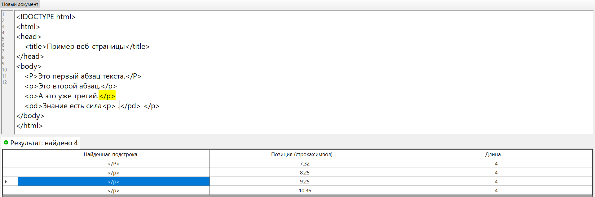
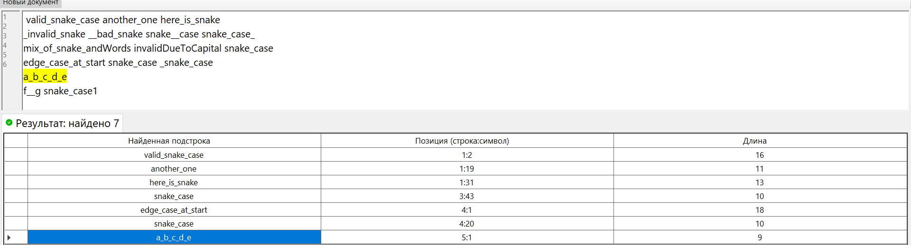
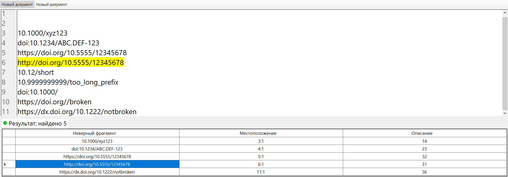
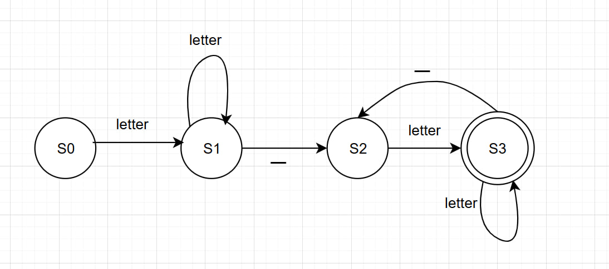
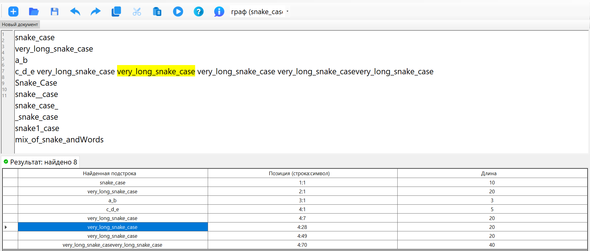

# Лабораторная работа №4. Реализация алгоритма поиска подстрок с помощью регулярных выражений

## Цель работы: 
Изучить теоретические основы регулярных выражений и их применение для поиска и извлечения подстрок из текста. Освоить практические навыки использования библиотечных средств работы с регулярными выражениями, а также интеграцию алгоритмов поиска в графический интерфейс приложения.

## **Автор:** 

 Cтудент группы АВТ-313 Геращенко Антон Евгеньевич

## Постановка задачи:
Разработать модуль поиска подстрок с использованием регулярных выражений, интегрировать его в существующее приложение (текстовый редактор) и обеспечить наглядный вывод результатов.
### Вариант:
1) №8. Построить РВ для поиска закрывающего HTML-тега \</p>
2) №17. Построить РВ для поиска переменной в стиле snakeCase (используют только строчные буквы и нижние подчеркивания).
3) №8. Построить РВ для проверки данных полного DOI (идентификатор цифрового объекта).

# Решение задач:

## 1. Поиск закрывающего HTML-тега \</p>
### a) Описание задачи;
Найти в тексте все закрывающие теги абзацев HTML вида: \</p> \</P>
### b) Регулярное выражение с пояснением каждого обозначения.
```
</[pP]>

Описание:
<, /, > - символы,
[pP] - класс символов (P или p)
```
### c) Примеры строк, которые должны находиться;
```
</p>
</P>
text</p>more
</P> end
```
### d) Примеры строк, которые не должны находиться;
```
<p>
</pp>
</p extra>
< /p>
```
### e) Тестовый пример:


## 2. Поиск переменной в стиле snakeCase (используются только строчные буквы и нижние подчеркивания)
### a) Описание задачи;
Найти слова, соответствующие строгому snake_case: хотя бы один символ '_'.
### b) Регулярное выражение с пояснением каждого обозначения.
```
\b[a-z]+(?:_[a-z]+)+\b

Описание:
\b - границы слова,
[a-z]+ - усеченная итерация любого символа английского строчного алфавита,
(?: ) - объявление незахватывающей группы,
(?:_[a-z]+)+ - усеченная итерация цепочки _letter^+
```
### c) Примеры строк, которые должны находиться;
```
snake_case
very_long_snake_case
a_b
c_d_e

```
### d) Примеры строк, которые не должны находиться;
```
Snake_Case
snake__case
snake_case_
_snake_case
snake1_case
mix_of_snake_andWords
```
### e) Тестовый пример:


## 3. Проверка данных полного DOI (идентификатор цифрового объекта)
### a) Описание задачи;
Найти DOI в тексте в одном из форматов:
```
1) 10.xxxx/xxxxx
2) doi:10.xxxx/...
3) https://doi.org/10.xxxx/...
4) https://dx.doi.org/10.xxxx/...
В суффиксе допускаются только символы -._;()/:A-Za-z0-9
Регистрационный номер в префиксе - от 4 до 9 символов.
```
### b) Регулярное выражение с пояснением каждого обозначения.
```
\b(?:https?://(?:dx\.)?doi\.org/|doi:)?10\.\d{4,9}/(?!/)[-._;()/:A-Za-z0-9]+(?=\s|$)

Описание:
\b - границы слова,
(?: ) - объявление незахватывающей группы,
https?:// - набор символов, s - необязательный,
(?:dx\.)? - необязательная часть DOI (старый формат); символы dx и экранированная точка,
doi\.org/ - обязательная часть если домен,
｜doi: - либо ищем префикс doi: вместо https://...,
(?:https?://(?:dx\.)?doi\.org/|doi:)? - в общем необязательная часть DOI - DOI resolver,
10\. - обязательное начало префикса doi,
\d{4,9} - уникальный номер префикса - от 4 до 9 цифр,
(?!/) - запрет слеша (избежание двойного в начале суффикса),
[-._;()/:A-Za-z0-9]+ - суффикс - усеченная итерация любого набора символов из -._;()/:A-Za-z0-9, правило описано:
https://www.crossref.org/documentation/member-setup/constructing-your-dois/,
(?=\s|$) - справа обязательно или пробел или конец строки, но не входящий в выражение.
```
### c) Примеры строк, которые должны находиться;
```
10.1000/xyz123
doi:10.1234/ABC.DEF-123
https://doi.org/10.5555/12345678
http://doi.org/10.5555/12345678
http://dx.doi.org/10.5555/12345678
```
### d) Примеры строк, которые не должны находиться;
```
10.12/short
10.9999999999/too_long_prefix
doi:10.1000/
https://doi.org//broken
```
### e) Тестовый пример:


# Дополнительное задание: 
**Для задачи из 2 блока необходимо реализовать алгоритм поиска подстрок в тексте, перейдя к графу автомата.** 
### Задача - поиск переменной в стиле snakeCase
## Граф автомата, приведенный к ДКА:

### Тестовый пример:

