# Лабораторная работа №6. Создание внутренней формы представления программы


## Цель работы: 
Изучить методы построения внутреннего представления программы (ВПП) на основе контекстно-свободной грамматики, реализовать синтаксический анализатор методом рекурсивного спуска и преобразовать арифметические выражения в тетрады и ПОЛИЗ.

## **Автор:** 

 Cтудент группы АВТ-313 Геращенко Антон Евгеньевич

## Постановка задачи:
1) Реализовать поиск лексических и синтаксических ошибок для заданной КС-грамматики методом рекурсивного спуска.
2) Представить внутреннюю форму программы в виде тетрад (op, arg1, arg2, result) для арифметических выражений (только для корректных строк).
3) Преобразовать выражение в ПОЛИЗ (польскую инверсную запись) и вычислить его значение (только арифметическое выражение из целых чисел).

## Вариант задания: язык Kotlin
КС-грамматика:
```
E → TA
A → ε | + TA | - TA
T → FB
B → ε | * FB | / FB | % FB
F → num | id | (E)
id → letter {letter | digit | _}
num → digit {digit}
```
### Примеры верных строк:
1) 5 + 5 * (5 + 5)
2) 1 + 2 / (3 - (3 + (5 - 2)))
3) (((1 + 2))) - ((4 + 1)) + (1 + 2)

## Диаграмма лексера
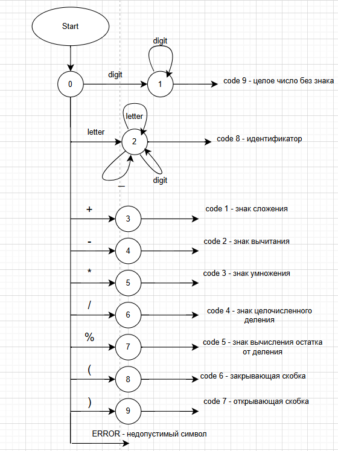
## Схема рекурсивного спуска:
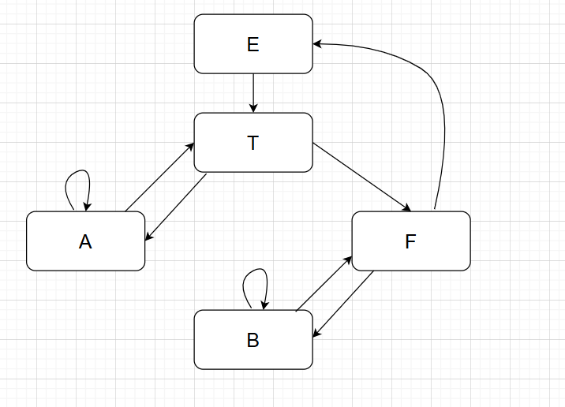 

## Примеры работы лексера:
1) Пример №1:
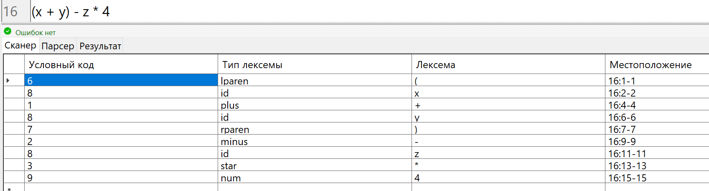
2) Пример №2:
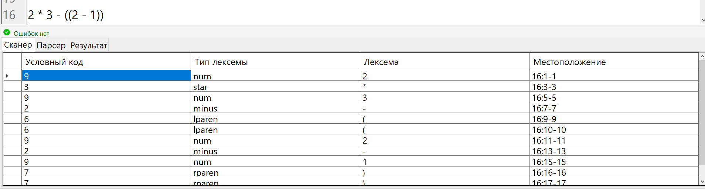

## Примеры работы парсера:
1) Пример №1:
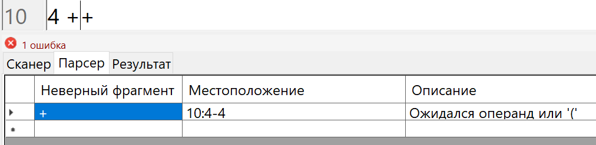
2) Пример №2:
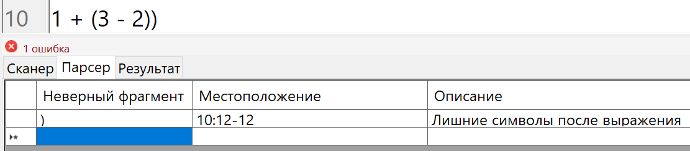
2) Пример №3:
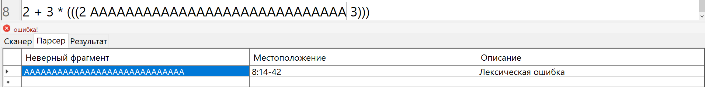

## Примеры разбиения на тетрады, формирования ПОЛИЗ и вычисления выражения:
1) Пример №1:
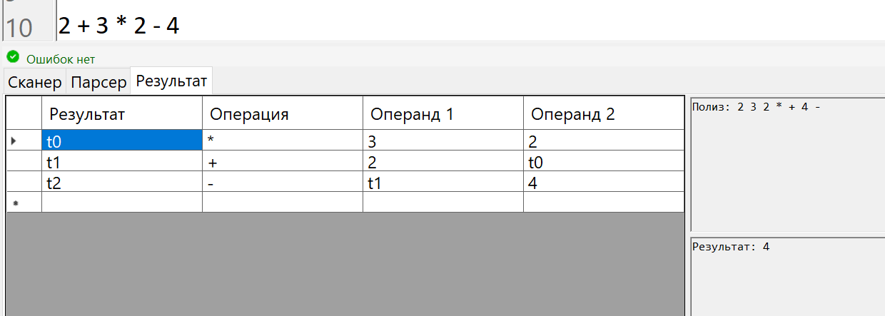
2) Пример №2:
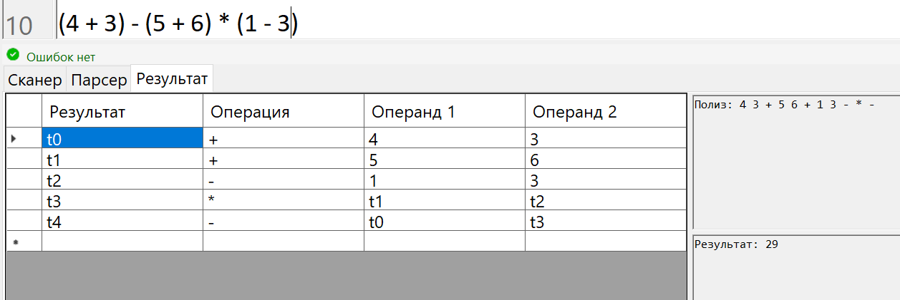
3) Пример №3:
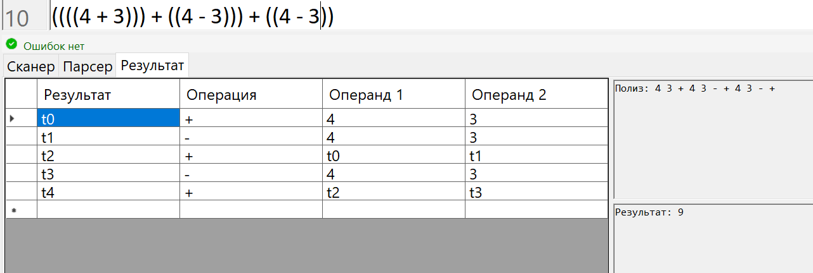
4) Пример №4:
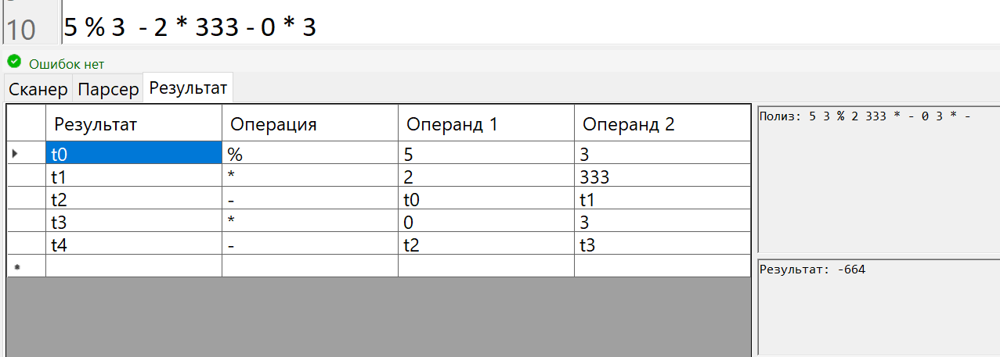
4) Пример №5:
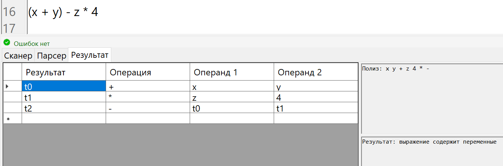
