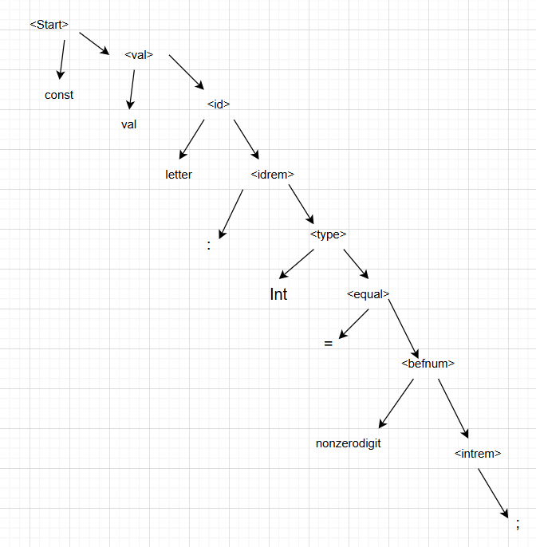
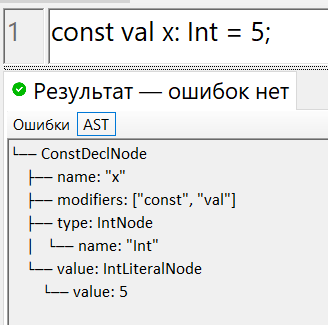
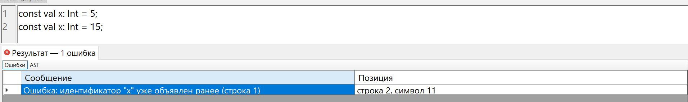
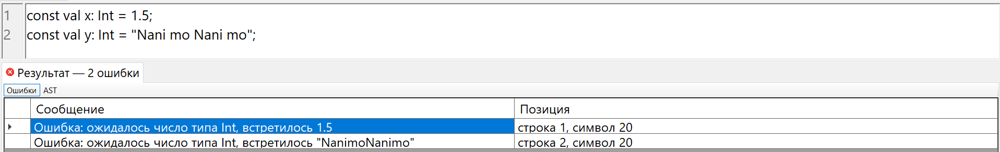
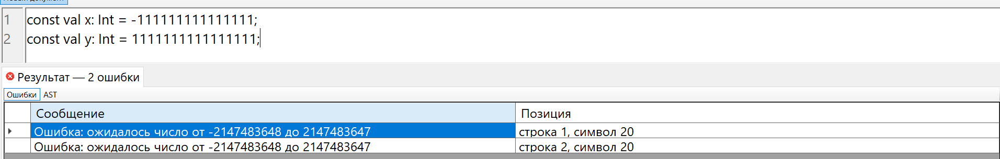
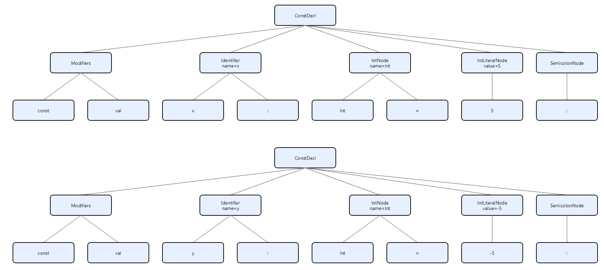

# Лабораторная работа №5. Построение AST и проверка контекстно-зависимых условий


## Цель работы: 
Изучить назначение и принципы работы семантического анализатора в структуре компилятора. Освоить методы построения абстрактного синтаксического дерева (AST) и проверки контекстно-зависимых условий (семантических правил) для заданной синтаксической конструкции.

## **Автор:** 

 Cтудент группы АВТ-313 Геращенко Антон Евгеньевич

## Постановка задачи:
Вариант - объявление целочисленной константы языка Kotlin.
### Примеры верных строк:
1) const val x: Int = 10;
2) const val _number: Int = -5;
3) const val index123: Int = 0;

# Контекстно-зависимые условия
1) Правило 1 (уникальность идентификаторов):
Пример:
```
const val x: Int = 5;
const val x: Int = 10;

Ошибка: идентификатор "x" уже объявлен ранее
```
2) Правило 2 (совместимость типов): Проверить, что тип инициализирующего значения соответствует объявленному типу:
Пример:
```
const val y: Int = "hello";
const val z: Int = 12.5;

Ошибка: ожидалось число типа Int, встретилось "hello"
Ошибка: ожидалось число типа Int, встретилось 12.5
```
3) Правило 3 (допустимые значения): Проверить, что значение находится в допустимых пределах:
```
const val d: Int = -111111111111111111;

Ошибка: ожидалось число от -2147483648 до 2147483647
```

# Структура AST:
## a) Типы узлов:
1) ConstDeclNode:
```
Атрибуты:
Name — имя константы
Modifiers — список модификаторов (const, val)
Type — тип значения
Value — значение литерала

Дочерние узлы:
IntNode, IntLiteralNode
```
2) IntNode:
```
Атрибуты:
Name = "Int"
```
3) IntLiteralNode
```
Атрибуты:
Value — числовое значение
```
## b) Рисунок AST для верной строки:
Строка: const val i: Int = 5;

## c) Формат вывода AST в программе:
Строка: const val x: Int = 5;


# Тестовые примеры
1) Пример №1: нарушение 1 правила:

2) Пример №2: нарушение 2 правила:

3) Пример №2: нарушение 3 правила:


# Инструкция по запуску: 
Путь к исполняемому файлу: "..\bin\Debug\net9.0-windows\compiles_lab_1.exe"
1) Открыть проект в Visual Studio 2022 (или новее).
2) Убедиться, что установлен .NET 9.0 SDK.
3) В меню выбрать: Build → Build Solution
4) Запустить проект: Debug → Start Debugging
# Дополнительное задание:
## Использованные графические средства:
Визуализация Ast реализована с помощью библиотеки SkiaSharp.
```
Необходимые пакеты nudget:
SkiaSharp
SkiaSharp.Views.Desktop.Common
SkiaSharp.Views.WindowsForms
```
# Тестовый пример:
```
const val x: Int = 5;
const val y: Int = -5;
```

